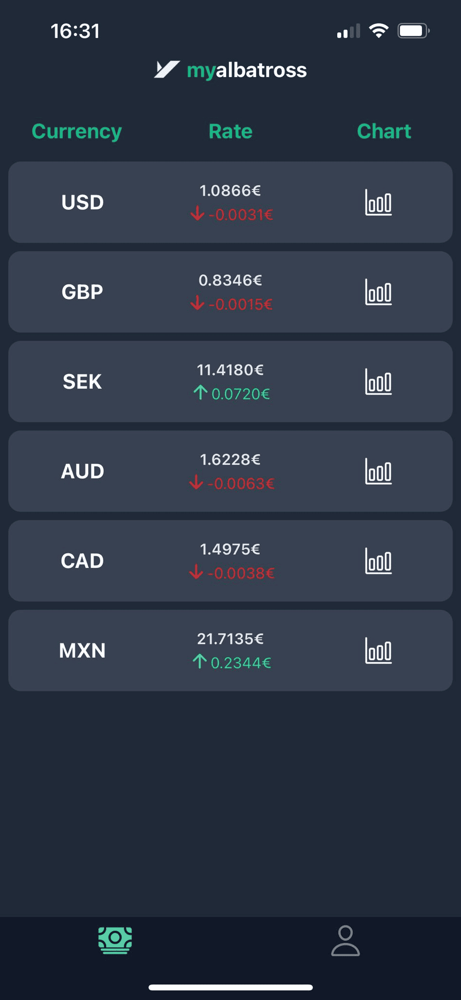
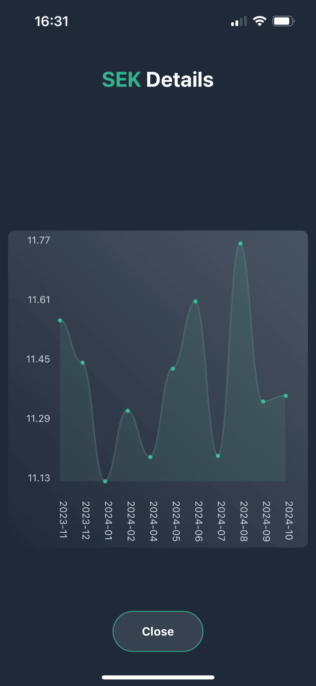
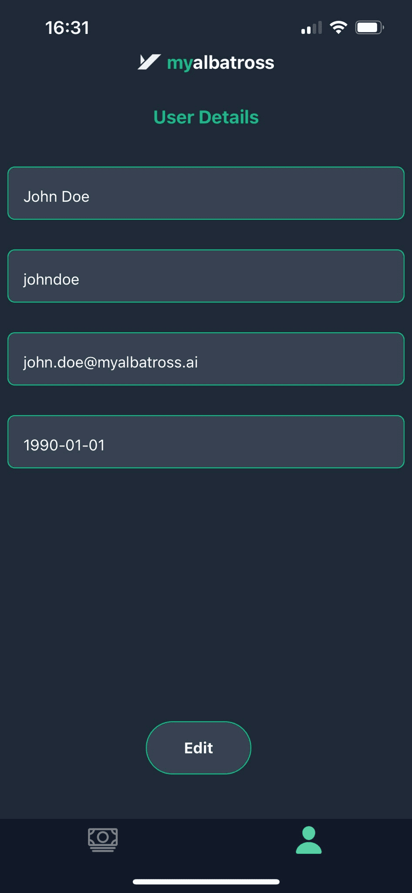

# **Prueba Técnica para My Albatross - Currencies App**

Esta aplicación permite a los usuarios visualizar una lista de divisas, incluyendo su tasa de cambio actual, y consultar un historial detallado con gráficos para cada divisa.

---





## **Características**

- Visualización de una lista de divisas con su tasa de cambio actual según la API proporcionada para la prueba.
- Indicadores de subida/bajada en las tasas de cambio.
- Acceso al detalle de cada divisa, incluyendo un historial de tasas en formato gráfico.
- Interfaz optimizada para dispositivos móviles.

---

## **Tecnologías Utilizadas**

### **Frontend**

- **React Native**: Biblioteca principal para construir la interfaz de usuario.
- **Expo**: Framework para facilitar el desarrollo y testing de la aplicación.
- **TypeScript**: Lenguaje para garantizar un código más robusto y tipado.
- **Redux Toolkit**: Para la gestión del estado global de la aplicación.
- **Axios**: Cliente HTTP para realizar peticiones a la API.

### **Estilos**

- **Tailwind CSS** (con NativeWind): Framework para el diseño responsivo y estilización rápida.

---

## **Instalación y Configuración**

### **Requisitos Previos**

- **Node.js** (versión 16 o superior).
- **Expo CLI**: Instalación global de Expo.
- **Android Studio** - **Xcode** - **ExpoGo**: Para emular la aplicación o ejecutarla en dispositivos reales.
- **Tendrás que configurar las variables de entorno de llamada a la API en un archivo .env.local**

### **Pasos de Instalación**

1. Clona este repositorio:

   ```bash
   git clone https://github.com/srdgz/my-albatross-pt
   cd my-albatross-pt

   ```

2. Instala las dependencias del proyecto:

   ```bash
   npm install

   ```

3. Inicia el servidor de desarrollo de Expo:

   ```bash
   npm run start

   ```

4. Ejecuta la aplicación en el emulador o tu dispositvo.
